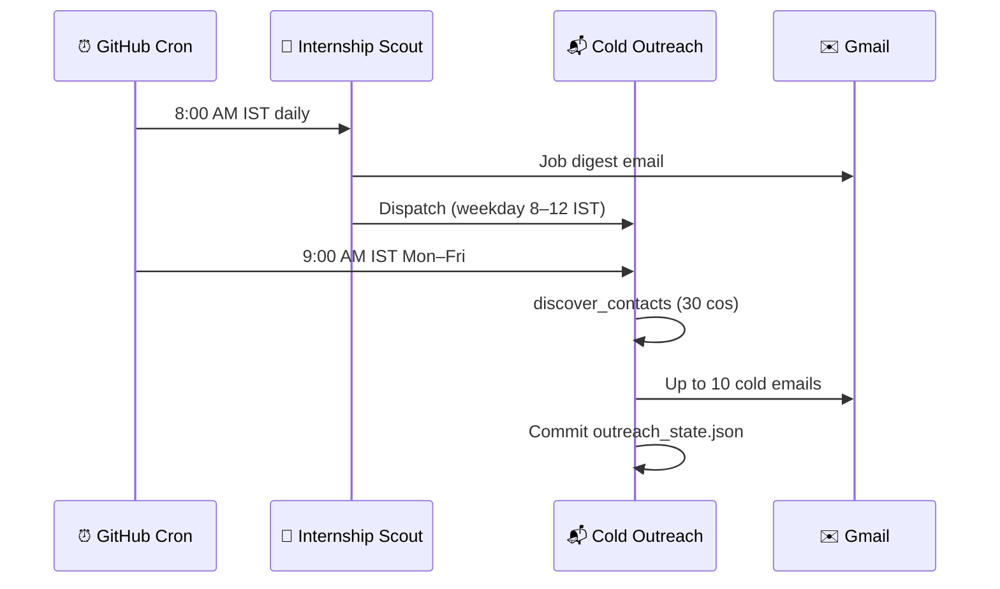

<div align="center">

# Resume Optimiser

### One repo. Full internship pipeline — scout → practice → outreach.

[](https://github.com/Ojas-Srivastava05/resume-optimiser/actions/workflows/internship-scout.yml)
[](https://github.com/Ojas-Srivastava05/resume-optimiser/actions/workflows/cold-outreach.yml/badge.svg)
[](https://github.com/Ojas-Srivastava05/resume-optimiser/actions/workflows/daily-oa.yml/badge.svg)
[](https://github.com/Ojas-Srivastava05/resume-optimiser/actions/workflows/hiring-contacts-discover.yml/badge.svg)

**Batch 2028 · Summer 2027 internships · Built by [Ojas Srivastava](https://github.com/Ojas-Srivastava05)**

[Scout](#-internship-scout) · [OA Forge](#-oa-forge) · [Hiring Contacts](#-hiring-contacts--cold-outreach) · [Documents](#-resume--document-collections) · [Automation Schedule](#-automation-schedule-ist)

</div>

---

## At a glance

| | |
|---|---|
| **~965** | companies in the scout universe |
| **10,700+** | harvested hiring contacts |
| **8,700+** | outreach-eligible emails (MX-verified, tiered) |
| **10/day** | cold emails (quality-capped, weekday auto-send) |
| **6** | GitHub Actions workflows — zero manual triggers needed |

---

## The big picture

```mermaid
flowchart TB
    subgraph 🌐 Sources
        BOARDS[Job boards & ATS<br/>Greenhouse · Lever · Ashby · LinkedIn]
        SHEET[Google Referral Sheet]
        GH[GitHub contact repos]
        WEB[HR directories & career portals]
        LC[LeetCode companywise repos]
    end

    subgraph 🔭 internship-scout
        CSV[(all_companies.csv<br/>~965 companies)]
        SCOUT[scout.py<br/>daily digest]
        OA[oa_scout.py<br/>2 Q/day drill]
    end

    subgraph 📬 hiring-contacts
        HARVEST[refresh · discover · bulk_discover]
        MASTER[(master_contacts.csv)]
        COLD[cold_outreach.py<br/>10/day cap]
    end

    subgraph ⚔️ OA-Forge
        BANK[Evidence-tier question bank]
        APP[Next.js mock OA app]
        VERCEL[Vercel]
    end

    subgraph ✉️ Delivery
        SMTP[Gmail SMTP]
        INBOX[Your inbox]
    end

    SHEET --> CSV
    BOARDS --> SCOUT
    CSV --> SCOUT
    CSV --> HARVEST
    CSV --> BANK
    GH --> HARVEST
    WEB --> HARVEST
    LC --> OA

    SCOUT --> SMTP --> INBOX
    OA --> SMTP

    HARVEST --> MASTER --> COLD --> SMTP

  BANK --> APP --> VERCEL
```

> **Hub file:** `internship-scout/data/all_companies.csv` feeds the scout, contact harvester, and OA question scraper.

---

## Three automation pillars

<table>
<tr>
<td width="33%" valign="top">

### 🔭 Internship Scout
[`internship-scout/`](internship-scout/)

Multi-source job + hackathon aggregator.

- Scrapes **15+ sources** (ATS APIs, careers pages, Unstop, Adzuna…)
- Filters for **batch 2028**, India, SWE/ML/AI roles
- **Daily HTML digest** to your inbox
- Dedup via local JSON + **Supabase**
- **launchd** fallback on macOS

</td>
<td width="33%" valign="top">

### ⚔️ OA Forge
[`OA-Forge/`](OA-Forge/)

Evidence-based mock OA platform.

- Questions only with **documented occurrences** (tiers A/B/C)
- Company-specific pools from **926+ slugs**
- Timed sessions + debrief reveal
- **Supabase** backend · **Vercel** deploy
- Daily scrape from scout company list

</td>
<td width="33%" valign="top">

### 📬 Hiring Contacts
[`hiring-contacts/`](hiring-contacts/)

Contact harvester + cold outreach engine.

- **10,700+** contacts from portals, HR CSVs, web directories
- **MX validation** · bounce blocklist · stale-source filtering
- **Named recruiters first**, then live-scraped inboxes
- Plain-text emails + resume PDF attachment
- 5-day follow-up queue

</td>
</tr>
</table>

---

## Automation schedule (IST)

```mermaid
gantt
    title Daily & weekly automations
    dateFormat HH:mm
    axisFormat %H:%M

    section Every day
    OA Daily Drill           :active, 07:30, 20m
    Internship Scout digest  :active, 08:00, 30m
    Cold outreach (Mon–Fri)  :crit, 09:00, 60m

    section Weekly
    Contact discover         :06:30, 30m
    Full contact refresh     :08:00, 60m
```



| Workflow | When | What it does |
|----------|------|----------------|
| [**OA Daily Drill**](.github/workflows/daily-oa.yml) | Daily **7:30 AM** | 2 LeetCode-style questions from rotating company pools |
| [**Internship Scout**](.github/workflows/internship-scout.yml) | Daily **8:00 AM** | Job digest email → on success, **chains** cold outreach on weekday mornings |
| [**Cold Outreach**](.github/workflows/cold-outreach.yml) | Mon–Fri **9:00 / 9:30 / 10:00 AM** | Discover 30 companies + send up to **10** cold emails |
| [**Contact Discover**](.github/workflows/hiring-contacts-discover.yml) | Mon/Wed/Fri/Sat **6:30 AM** | Incremental career-portal probing |
| [**Contact Refresh**](.github/workflows/hiring-contacts-refresh.yml) | Sunday **8:00 AM** | Full re-ingest from GitHub repos + web directories |

All workflows support **manual dispatch** from the Actions tab.

---

## Cold outreach pipeline

```mermaid
flowchart LR
    A[Career portals<br/>964 companies probed] --> B{Live scrape?}
    B -->|Yes| C[scraped_personal<br/>345 emails]
    B -->|No| D[MX-validated<br/>campus@ / talent@]
    E[HR CSVs<br/>79k rows] --> F[Scout domain match<br/>502 imported]
    G[Web directories<br/>MX verified] --> H[39 named HR]
    C --> I[master_contacts.csv]
    D --> I
    F --> I
    H --> I
    I --> J[Queue ranker<br/>blocklist · tiers]
    J --> K[10 emails/day<br/>45s apart]
    K --> L[Gmail SMTP]
```

**Quality gates:** stale `careerLauncher` / Substack bulk lists blocked · bounce tracking · 1 company/day · mega-corp `careers@` rejected · follow-up after 5 days.

---

## Repository map

```
Resume Optimiser/
│
├── 🔭 internship-scout/     Job & hackathon scout · OA daily drill
├── 📬 hiring-contacts/        Contact DB · cold email automation
├── ⚔️  OA-Forge/               Mock OA web app (Next.js + Supabase)
│
├── 📄 Resume Collection/      Tailored PDF resumes (Google, MS, Amazon…)
├── 📄 Cover Letter Collection/ Per-company cover letters
├── 📄 Latex Collection/       LaTeX sources for resumes & SOPs
│
└── ⚙️  .github/workflows/     6 scheduled GitHub Actions
```

---

## Resume & document collections

Static, manually maintained application assets — not automated, but part of the same pipeline:

| Folder | Contents |
|--------|----------|
| [`Resume Collection/`](Resume%20Collection/) | 12 company-tailored PDF resumes |
| [`Cover Letter Collection/`](Cover%20Letter%20Collection/) | Cover letters (tex / pdf / docx) |
| [`Latex Collection/`](Latex%20Collection/) | LaTeX sources — Google, Microsoft, Flipkart, EA, Amazon MLSS… |

Cold outreach attaches `ojas_srivastava_resume.pdf` from the Resume Collection.

---

## Tech stack

| Component | Stack |
|-----------|-------|
| **Internship Scout** | Python 3.12 · BeautifulSoup · Supabase · Gmail SMTP |
| **Hiring Contacts** | Python 3.12 · CSV/JSON state · `dig` MX checks · stdlib HTTP |
| **OA Forge** | Next.js 13 · TypeScript · Tailwind · Supabase · Vercel |
| **CI/CD** | GitHub Actions · artifact cache · auto-commit state back to `main` |
| **Email** | Gmail app password · plain-text only (deliverability) |

---

## Quick start

```bash
# Internship Scout (local)
cd internship-scout && pip install -r requirements.txt
cp .env.example .env   # fill SMTP + Supabase
python scout.py --fast

# Cold outreach (preview)
cd hiring-contacts && pip install -r requirements.txt
python cold_outreach.py --dry-run --limit 5

# OA Forge (dev)
cd OA-Forge && npm install && npm run dev
```

**Secrets** (GitHub Actions): `SMTP_EMAIL`, `SMTP_APP_PASSWORD`, `RECIPIENT_EMAIL`, `SUPABASE_URL`, `SUPABASE_KEY`

---

## Trigger chain



---

## Author

**Ojas Srivastava** — B.Tech AI, SVNIT Surat · CGPA 9.20 · Batch 2028

- [GitHub](https://github.com/Ojas-Srivastava05)
- [Portfolio](https://ojas-srivastava.vercel.app)
- [LinkedIn](https://www.linkedin.com/in/ojas-srivastava05)

---

<div align="center">

*Built to run while you sleep — scout in the morning, practice at lunch, outreach by 9.*

</div>
