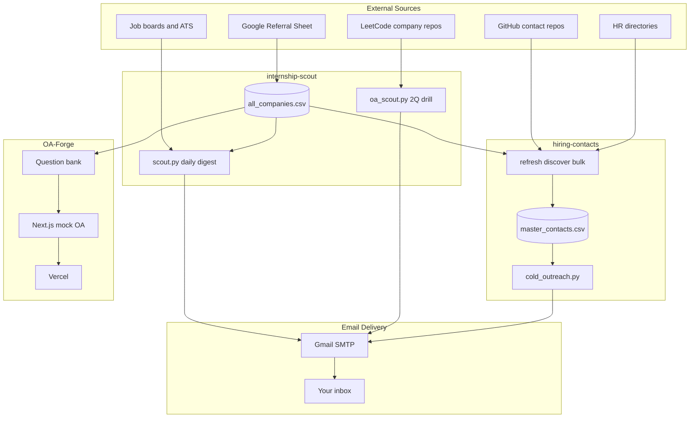
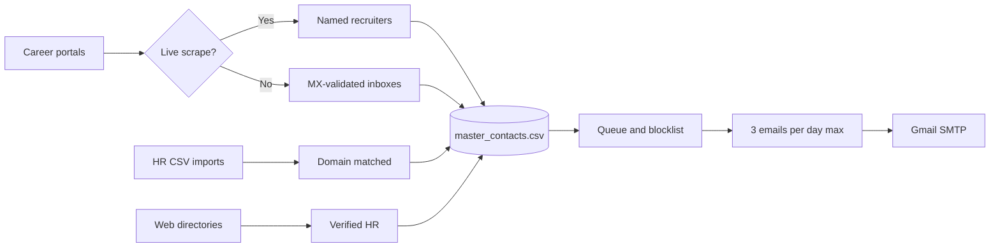
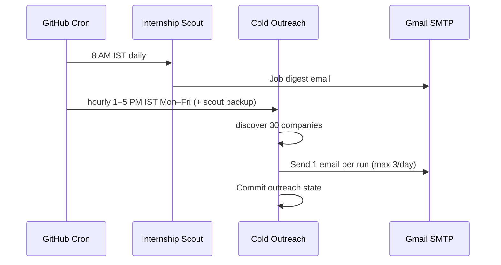

<div align="center">

# Resume Optimiser

### One repo. Full internship pipeline — scout → practice → outreach.

[](https://github.com/Ojas-Srivastava05/resume-optimiser/actions/workflows/internship-scout.yml)
[](https://github.com/Ojas-Srivastava05/resume-optimiser/actions/workflows/cold-outreach.yml/badge.svg)
[](https://github.com/Ojas-Srivastava05/resume-optimiser/actions/workflows/daily-oa.yml/badge.svg)
[](https://github.com/Ojas-Srivastava05/resume-optimiser/actions/workflows/hiring-contacts-discover.yml/badge.svg)

**Batch 2028 · Summer 2027 internships · Built by [Ojas Srivastava](https://github.com/Ojas-Srivastava05)**

[Scout](#-internship-scout) · [OA Forge](#-oa-forge) · [Hiring Contacts](#-hiring-contacts--cold-outreach) · [Documents](#-resume--document-collections) · [Automation Schedule](#-automation-schedule-ist)

</div>

---

## At a glance

| | |
|---|---|
| **~965** | companies in the scout universe |
| **10,700+** | harvested hiring contacts |
| **8,700+** | outreach-eligible emails (MX-verified, tiered) |
| **3/day** | cold emails max (hourly 1–5 PM IST weekdays + backups) |
| **6** | GitHub Actions workflows — zero manual triggers needed |

---

## The big picture



> **Hub file:** `internship-scout/data/all_companies.csv` feeds the scout, contact harvester, and OA question scraper.

---

## Three automation pillars

<table>
<tr>
<td width="33%" valign="top">

### 🔭 Internship Scout
[`internship-scout/`](internship-scout/)

Multi-source job + hackathon aggregator.

- Scrapes **15+ sources** (ATS APIs, career portals, Unstop, Adzuna…)
- **100 career portals/day** — full 964-company cycle in ~10 days (benchmarked; 964/run ≈ 64 min)
- Filters for **batch 2028**, India, SWE/ML/AI roles
- **Daily HTML digest** to your inbox (~11 min GitHub Actions run)
- Dedup via local JSON + **Supabase**
- **launchd** fallback on macOS

</td>
<td width="33%" valign="top">

### ⚔️ OA Forge
[`OA-Forge/`](OA-Forge/)

Evidence-based mock OA platform.

- Questions only with **documented occurrences** (tiers A/B/C)
- Company-specific pools from **926+ slugs**
- Timed sessions + debrief reveal
- **Supabase** backend · **Vercel** deploy
- Daily scrape from scout company list

</td>
<td width="33%" valign="top">

### 📬 Hiring Contacts
[`hiring-contacts/`](hiring-contacts/)

Contact harvester + cold outreach engine.

- **10,700+** contacts from portals, HR CSVs, web directories
- **MX validation** · bounce blocklist · stale-source filtering
- **Named recruiters first**, then live-scraped inboxes
- Plain-text emails + resume PDF attachment
- 5-day follow-up queue

</td>
</tr>
</table>

---

## Automation schedule (IST)

```mermaid
gantt
    title Daily and weekly automations
    dateFormat HH:mm
    axisFormat %H:%M
    section Every day
    OA Daily Drill           :active, 07:30, 20m
    Internship Scout digest  :active, 08:00, 15m
    Cold outreach weekdays   :crit, 13:00, 180m
    section Weekly
    Contact discover         :06:30, 30m
    Full contact refresh     :08:00, 60m
```



| Workflow | When | What it does |
|----------|------|----------------|
| [**OA Daily Drill**](.github/workflows/daily-oa.yml) | Daily **7:30 AM** | 2 LeetCode-style questions from rotating company pools |
| [**Internship Scout**](.github/workflows/internship-scout.yml) | Daily **8:00 AM** | Job digest email (no chained cold outreach) |
| [**Cold Outreach**](.github/workflows/cold-outreach.yml) | Mon–Fri **1:00 / 2:00 / 3:00 PM** | Discover contacts + send **1** email per run (**3/day max**) |
| [**Contact Discover**](.github/workflows/hiring-contacts-discover.yml) | Mon/Wed/Fri/Sat **6:30 AM** | Incremental career-portal probing |
| [**Contact Refresh**](.github/workflows/hiring-contacts-refresh.yml) | Sunday **8:00 AM** | Full re-ingest from GitHub repos + web directories |

All workflows support **manual dispatch** from the Actions tab.

---

## Cold outreach pipeline



**Quality gates:** stale `careerLauncher` / Substack bulk lists blocked · bounce tracking · 1 company/day · mega-corp `careers@` rejected · follow-up after 5 days.

---

## Repository map

```
Resume Optimiser/
│
├── internship-scout/          Job & hackathon scout · OA daily drill
├── hiring-contacts/           Contact DB · cold email automation
├── OA-Forge/                  Mock OA web app (Next.js + Supabase)
│
├── Resume Collection/         Compiled PDF resumes & SOPs (Ojas only)
├── Cover Letter Collection/   Compiled cover letters (PDF / docx / txt)
├── Latex Collection/          LaTeX sources only (.tex) — compile → collections above
├── Peers Resume Collection/   Ananya, Karan, Vansh, Varun (not Ojas)
├── Reference Collection/      Supporting docs (not application packages)
│   ├── NPTEL/                 NPTEL stats, rankings, MOOC research PDFs
│   ├── Academic/              Transcript, syllabus, Coursera, SOP samples
│   ├── Personal/              Local-only identity docs + LinkedIn about (gitignored)
│   ├── Screenshots/           Application form screenshots
│   └── Planning/              Pipeline blueprints & interview prep notes
│
├── scripts/                   NPTEL / interview PDF generators
└── .github/workflows/         Scheduled GitHub Actions
```

---

## Resume & document collections

Static application assets — not automated, but part of the same pipeline.

| Folder | Contents |
|--------|----------|
| [`Resume Collection/`](Resume%20Collection/) | Ojas company-tailored PDF resumes & SOPs |
| [`Cover Letter Collection/`](Cover%20Letter%20Collection/) | Ojas cover letters (pdf / docx / txt) |
| [`Latex Collection/`](Latex%20Collection/) | LaTeX sources only — compile into the PDF collections |
| [`Peers Resume Collection/`](Peers%20Resume%20Collection/) | Peer resumes (Ananya, Karan, Vansh, Varun) |
| [`Reference Collection/`](Reference%20Collection/) | NPTEL, academic PDFs, screenshots, planning notes |

Cold outreach attaches `ojas_srivastava_resume.pdf` from the Resume Collection (path unchanged).

---

## Tech stack

| Component | Stack |
|-----------|-------|
| **Internship Scout** | Python 3.12 · BeautifulSoup · Supabase · Gmail SMTP |
| **Hiring Contacts** | Python 3.12 · CSV/JSON state · `dig` MX checks · stdlib HTTP |
| **OA Forge** | Next.js 13 · TypeScript · Tailwind · Supabase · Vercel |
| **CI/CD** | GitHub Actions · artifact cache · auto-commit state back to `main` |
| **Email** | Gmail app password · plain-text only (deliverability) |

---

## Quick start

```bash
# Internship Scout (local)
cd internship-scout && pip install -r requirements.txt
cp .env.example .env   # fill SMTP + Supabase
python scout.py --fast

# Cold outreach (preview)
cd hiring-contacts && pip install -r requirements.txt
python cold_outreach.py --dry-run --limit 1

# OA Forge (dev)
cd OA-Forge && npm install && npm run dev
```

**Secrets** (GitHub Actions): `SMTP_EMAIL`, `SMTP_APP_PASSWORD`, `RECIPIENT_EMAIL`, `SUPABASE_URL`, `SUPABASE_KEY`

---

## Trigger chain



---

## Author

**Ojas Srivastava** — B.Tech AI, SVNIT Surat · CGPA 9.20 · Batch 2028

- [GitHub](https://github.com/Ojas-Srivastava05)
- [Portfolio](https://ojas-srivastava.vercel.app)
- [LinkedIn](https://www.linkedin.com/in/ojas-srivastava05)

---

<div align="center">

*Built to run while you sleep — scout in the morning, practice at lunch, outreach hourly 1–5 PM (max 3/day).*

</div>
