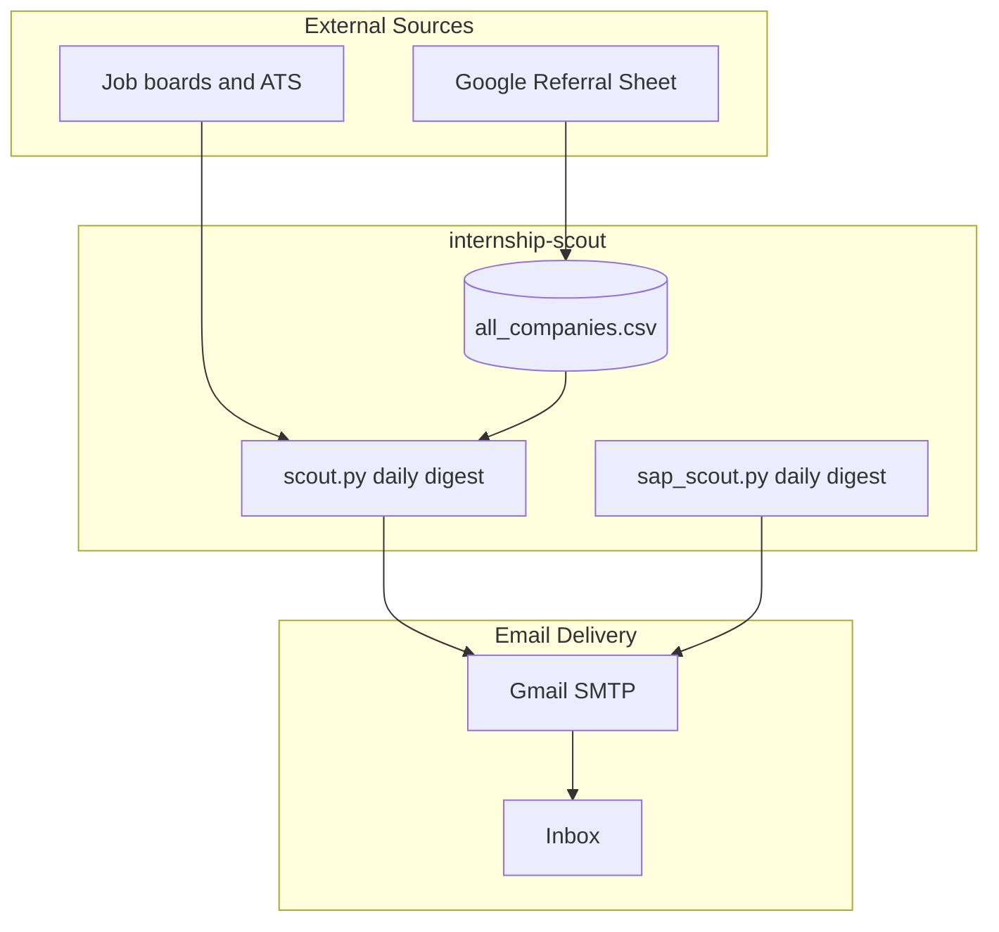

<div align="center">

# Resume Optimiser

### Internship + SAP job digests — the rest of the repo is prep assets, not scheduled automation.

[](https://github.com/Ojas-Srivastava05/resume-optimiser/actions/workflows/internship-scout.yml)
[](https://github.com/Ojas-Srivastava05/resume-optimiser/actions/workflows/sap-job-scout.yml)

**Batch 2028 · Summer 2027 internships · Built by [Ojas Srivastava](https://github.com/Ojas-Srivastava05)**

[Scout](#-internship-scout) · [SAP Scout](#-sap-job-scout) · [Documents](#-resume--document-collections) · [Automation Schedule](#-automation-schedule-ist)

</div>

---

## At a glance

| | |
|---|---|
| **~965** | companies in the scout universe |
| **2** | scheduled GitHub Actions workflows |
| **Daily** | internship digest + SAP digest (~8 AM IST) |

---

## Active automations

<table>
<tr>
<td width="50%" valign="top">

### 🔭 Internship Scout
[`internship-scout/`](internship-scout/)

Multi-source job + hackathon aggregator.

- Scrapes ATS APIs, career portals, Unstop, Adzuna, and more
- Filters for **batch 2028**, India, SWE/ML/AI roles
- **Daily HTML digest** to your inbox
- Dedup via local JSON + **Supabase**
- **launchd** fallback on macOS (`com.ojas.internship-scout`)

</td>
<td width="50%" valign="top">

### 🏢 SAP Job Scout
[`internship-scout/sap_scout.py`](internship-scout/sap_scout.py)

Separate digests for SAP UI5 / Fiori-style roles.

- Company roster in `internship-scout/data/sap_companies.csv`
- Sends to Ananya (+ monitor copy)
- Same SMTP secrets as Internship Scout
- Daily cron alongside the internship digest

</td>
</tr>
</table>

---

## Automation schedule (IST)

| Workflow | When | What it does |
|----------|------|----------------|
| [**Internship Scout**](.github/workflows/internship-scout.yml) | Daily **8:00 AM** (+ 12:30 PM backup) | Job + hackathon digest email |
| [**SAP Job Scout**](.github/workflows/sap-job-scout.yml) | Daily **8:00 AM** | SAP / Fiori openings digest |

Both support **manual dispatch** from the Actions tab.

OA drill, cold outreach, hiring-contact harvest, international radar, and BofA reminder workflows are **removed** — not scheduled.

---

## The big picture



> **Hub file:** `internship-scout/data/all_companies.csv` feeds the internship scout.

---

## Repository map

```
Resume Optimiser/
│
├── internship-scout/          Internship scout + SAP scout (only scheduled automation)
├── hiring-contacts/           Contact DB (manual / not scheduled)
├── OA-Forge/                  Mock OA web app (not scheduled)
│
├── Resume Collection/         Compiled PDF resumes & SOPs (Ojas only)
├── Cover Letter Collection/   Compiled cover letters
├── Latex Collection/          LaTeX sources
├── Peers Resume Collection/   Peer resumes
├── Reference Collection/      Supporting docs
├── Company Drives/            Campus-drive prep packs
├── GE Healthcare Preparation/ GE HealthCare intern prep
│
├── scripts/                   PDF generators
└── .github/workflows/         internship-scout + sap-job-scout only
```

---

## Resume & document collections

| Folder | Contents |
|--------|----------|
| [`Resume Collection/`](Resume%20Collection/) | Ojas company-tailored PDF resumes & SOPs |
| [`Cover Letter Collection/`](Cover%20Letter%20Collection/) | Ojas cover letters |
| [`Latex Collection/`](Latex%20Collection/) | LaTeX sources |
| [`Peers Resume Collection/`](Peers%20Resume%20Collection/) | Peer resumes |
| [`Reference Collection/`](Reference%20Collection/) | NPTEL, academic PDFs, OA prep, planning notes |
| [`Company Drives/`](Company%20Drives/) | GEP, Adobe, and other campus-drive prep packs |

---

## Tech stack

| Component | Stack |
|-----------|-------|
| **Internship Scout** | Python 3.12 · BeautifulSoup · Supabase · Gmail SMTP |
| **SAP Job Scout** | Same stack · separate recipient config |
| **CI/CD** | GitHub Actions · artifact cache |
| **Email** | Gmail app password |

---

## Quick start

```bash
# Internship Scout (local)
cd internship-scout && pip install -r requirements.txt
cp .env.example .env   # fill SMTP + Supabase
python scout.py --fast

# SAP Job Scout (local)
python sap_scout.py
```

**Secrets** (GitHub Actions): `SMTP_EMAIL`, `SMTP_APP_PASSWORD`, `RECIPIENT_EMAIL`, `EXTRA_RECIPIENTS`, `SAP_RECIPIENT_EMAIL`, `SUPABASE_URL`, `SUPABASE_KEY`

---

## Author

**Ojas Srivastava** — B.Tech AI, SVNIT Surat · CGPA 9.20 · Batch 2028

- [GitHub](https://github.com/Ojas-Srivastava05)
- [Portfolio](https://ojas-srivastava.vercel.app)
- [LinkedIn](https://www.linkedin.com/in/ojas-srivastava05)

---

<div align="center">

*Two digests a day — internship scout + SAP scout. Everything else is offline prep.*

</div>
